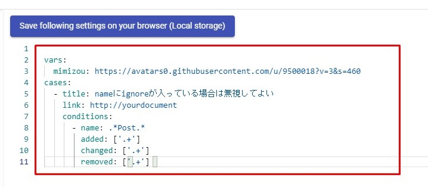

Check YAML
==========

本ページでは、Checked Alreadyの判定に使用するYAMLファイルの定義を記載します。

[](./resources/checkyaml.jpg)


定義
----

`T[]`はArray、`(T)`は任意指定の値です。

### CheckPoint

|  Key  |     Type     |            Description            | Example | Default |
| ----- | ------------ | --------------------------------- | ------- | ------- |
| vars  | Object       | 変数定義                          | -       | -       |
| cases | IgnoreCase[] | Checked Alreadyにするケースリスト | -       | -       |

`cases`で指定された複数ケースに当てはまる場合、差分は全てのケースに該当すると判定されます。  
最初に一致ケースを採用しない理由は、**正解でないケースに正解のケースが隠れてしまう**リスクを軽減するためです。

### IgnoreCase

|    Key     |    Type     |     Description      |     Example      | Default |
| ---------- | ----------- | -------------------- | ---------------- | ------- |
| title      | string      | ケースのタイトル     | 時刻の違いは無視 | -       |
| image      | (string)    | アイコン画像のURL    | http://hoge.png  | -       |
| link       | (string)    | 挿入するリンクのURL  | http://hoge.html | -       |
| conditions | Condition[] | ケースに該当する条件 | -                | -       |

`conditions`で指定された複数条件のうち、1つに合致すればケースに該当すると判定されます。

### Condition

|   Key   |    Type    |       Description        |                      Example                       | Default |
| ------- | ---------- | ------------------------ | -------------------------------------------------- | ------- |
| path    | (string)   | リクエストのpath         | `/human.+`                                         | -       |
| name    | (string)   | リクエストの名称         | `ケース.+`                                         | -       |
| added   | (string[]) | 追加されたプロパティパス | <pre>- root<'items'><[0-2]></br>- root<'id'></pre> | -       |
| changed | (string[]) | 変更されたプロパティパス | <pre>- root<'items'><[0-2]></br>- root<'id'></pre> | -       |
| removed | (string[]) | 削除されたプロパティパス | <pre>- root<'items'><[0-2]></br>- root<'id'></pre> | -       |

各keyの値は**正規表現の完全一致**として判定されます。


例
---

### スタンダード

```yaml
cases:
  - title: itemsのidが変更されても無視
    conditions:
      - changed:
          - root<'items'><\d+><'id'>
  - title: idが追加または削除されても問題ない
    conditions:
      - added:
          - root<'id'>
      - removed:
          - root<'id'>
```

### 特定pathやnameの場合だけ無視 + URL埋め込み

```yaml
cases:
  - title: nameにignoreが入っている場合は無視してよい
    link: http://yourdocument
    conditions:
      - name: .*ignore.*
        added: ['.+']
        changed: ['.+']
        removed: ['.+']
  - title: pingは無視
    link: http://yourdocument
    conditions:
      - path: /ping
        added: ['.+']
        changed: ['.+']
        removed: ['.+']
```

### アイコン画像に変数を指定

```yaml
vars:
  mimizou: https://avatars0.githubusercontent.com/u/9500018?v=3&s=460
cases:
  - title: timeが含まれる場合は無視
    image: '{{ mimizou }}'
    conditions:
      - changed:
          - .*<'time'>.*
  - title: プロパティ増加はいかなる場合も気にしない
    image: '{{ mimizou }}'
    conditions:
      - added:
          - .+
```


