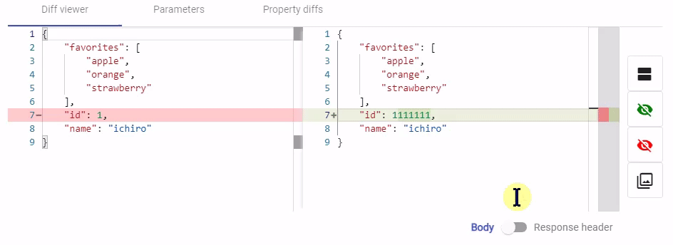

2.0.0   `📅 2021/06/16` 
===============================

## New features

### レスポンスヘッダの差分表示に対応しました

Diff Viewerの下部に追加されたトグルを切り替えるとレスポンスヘッダを表示します。

- [Jumeaux]からレスポンスヘッダを保存するには[Jumeauxのv3.0.0]で追加されたレスポンスヘッダ保存/比較オプションを有効にする必要があります
  - 上記を有効にしていない場合、レスポンスヘッダの表示は空になります
- レスポンスヘッダのdiffに以下の無視トグルは反映されません
  - Ignored (緑色の目アイコン)
  - Checked Already (赤色の目アイコン)
- 以下の場合でもレスポンスヘッダが保存されていれば表示されます
    - レスポンスボディを保存していないとき 
    - レスポンスボディの解析ができない場合 
    - レスポンスボディがバイナリの場合
- トグルの状態はブラウザ(Local Storage)に保存されます

## Others

* Angularのバージョンを9から10にアップしました
* 上記に伴い、関連packageを最新にしました
* 上記に伴い、デザインや挙動に軽微な変更が発生しています

[Jumeaux]: https://tadashi-aikawa.github.io/jumeaux/
[Jumeauxのv3.0.0]: https://tadashi-aikawa.github.io/jumeaux/ja/releases/v3/#3000
