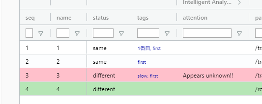
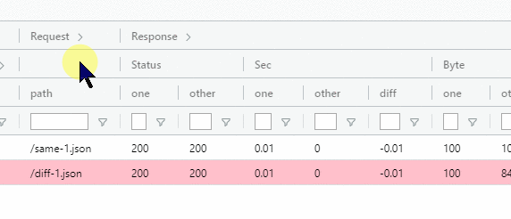
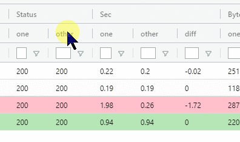
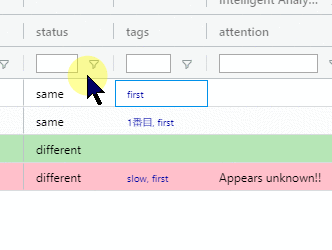
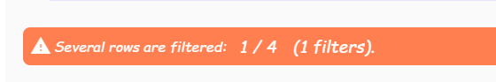
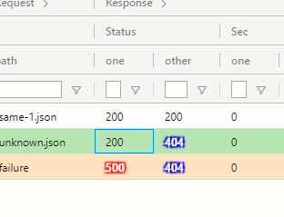

Trial table
===========

各リクエストに対する結果..Trial一覧テーブルの見方を説明します。

カラムの仕様
------------

| 大項目   | 中項目                | カラム名       | 説明                                  | 正規表現 | デフォルト絞り込み    | デフォルト表示 |
|----------|-----------------------|----------------|---------------------------------------|----------|-----------------------|----------------|
|          |                       | seq            | 実行順                                | O        | Contains              | O              |
|          |                       | name           | 名称                                  | O        | Contains              | O              |
| Result   |                       | status         | ステータス                            | O        | Contains              | O              |
| Result   |                       | tags           | タグ                                  | O        | Contains              | O              |
| Result   | Intelligent Analytics | attention      | 要注意情報                            | O        | Contains              | O              |
| Result   | Intelligent Analytics | checkedAlready | 既に確認済み差分情報                  | O        | Contains              | X              |
| Result   | Intelligent Analytics | ignored        | 無視してよい差分情報                  | O        | Contains              | X              |
| Request  |                       | path           | URLのpath                             | O        | Contains              | O              |
| Request  | queries               | number         | クエリのパラメータ数                  | O        | Contains              | X              |
| Request  | queries               | detail         | クエリ詳細                            | O        | Contains              | X              |
| Request  | queries               | encoded        | エンコード済みクエリ                  | X        | Contains              | X              |
| Response | Status                | one            | oneのステータスコード                 | O        | Contains              | O              |
| Response | Status                | other          | otherのステータスコード               | O        | Contains              | O              |
| Response | Sec                   | one            | oneのレスポンスタイム(秒)             | X        | Grater than or equals | O              |
| Response | Sec                   | other          | otherのレスポンスタイム(秒)           | X        | Grater than or equals | O              |
| Response | Sec                   | diff           | other - oneのレスポンスタイム差分(秒) | X        | Grater than or equals | O              |
| Response | Byte                  | one            | oneのバイト数                         | X        | Grater than or equals | O              |
| Response | Byte                  | other          | otherのバイト数                       | X        | Grater than or equals | O              |
| Response | Type                  | one            | oneのレスポンスタイプ                 | O        | Contains              | O              |
| Response | Type                  | other          | otherのレスポンスタイプ               | O        | Contains              | O              |
| Response | ContentType           | one            | oneのcontent-type                     | O        | Contains              | x              |
| Response | ContentType           | other          | otherのcontent-type                   | O        | Contains              | x              |
|          |                       | requestTime    | リクエスト日時                        | O        | Contains              | O              |

レコード種別
------------

Trialの状態によってレコードの種別が変わります。  
レコード種別が変わると背景色が変わります。

|      種別       |                背景色                 |                                       条件                                        |
| --------------- | ------------------------------------- | --------------------------------------------------------------------------------- |
| failure         | ■ | statusが`failure`                                                                 |
| attention       | ■    | attentionが`Appears unknown!!` または、 statusが`different` かつ attentionが`???` |
| both-failure    | ■  | attetionが`Both failure!!`                                                        |
| no-diff-keys    | ■  | attetionが`No diff keys!!`                                                        |
| checked-already | ■ | checkedAlreadyが空ではない かつ attentionが空                                     |

!> `checked-already`以外の種別は何か問題がある可能性が高いです。必ずチェックしましょう。

カラムの開閉
------------

`>`マークのあるカラムは更に展開できます。

ソート
------

カラムをクリックするとソートできます。  
Shiftを押しながら複数カラムを選択することもできます。

フィルタ
--------

フィルタ欄にキーワードを入れるとレコードをフィルタリングできます。  
フィルタ欄右のフィルタボタンを押すと、条件の変更やフィルタの複数指定ができます。

フィルタでレコードが絞り込まれているときは注意書きが表示されます。

これはフィルタが絞り込まれていることに気づかず問題を見逃すことを防ぐためです。

ステータスコード
----------------

400台は青に、500台は赤に背景が変わります。

ボタン
------

テーブルの上にあるボタンの説明です。

|       名称        |               効果               |
| ----------------- | -------------------------------- |
| Reformat table    | テーブルの幅を最適化する         |
| Visible all       | 削除したカラムを全て表示する     |
| Clear all filters | 入力されたフィルタを全て削除する |

